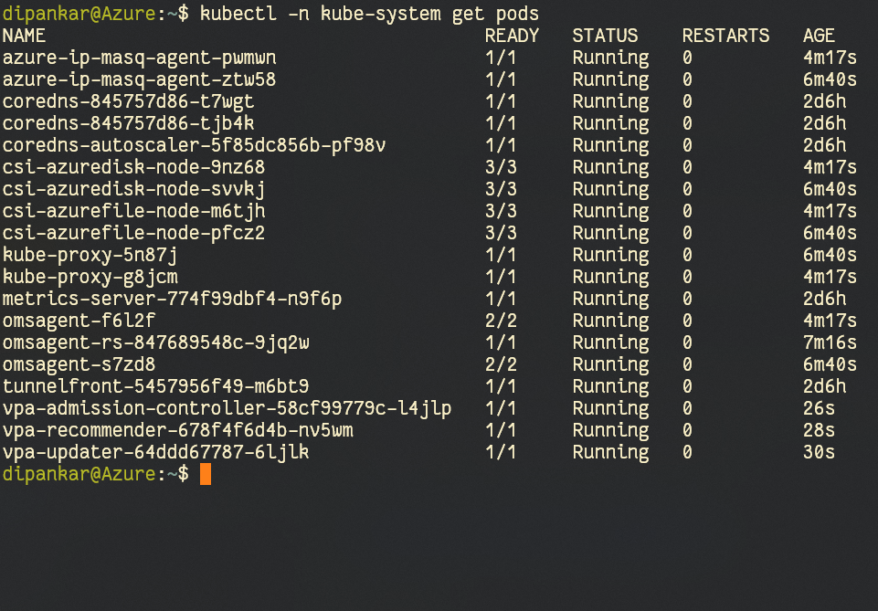
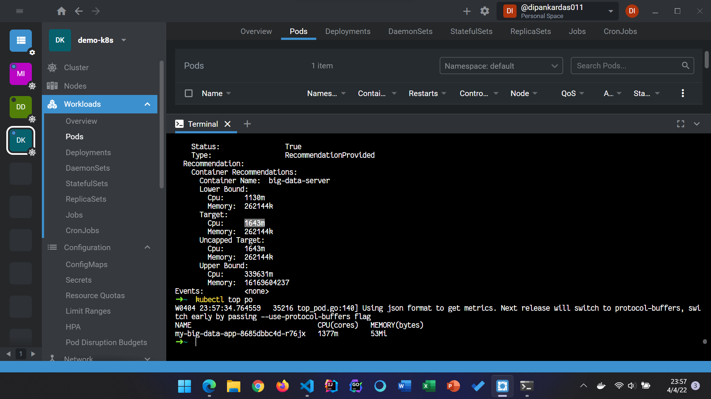
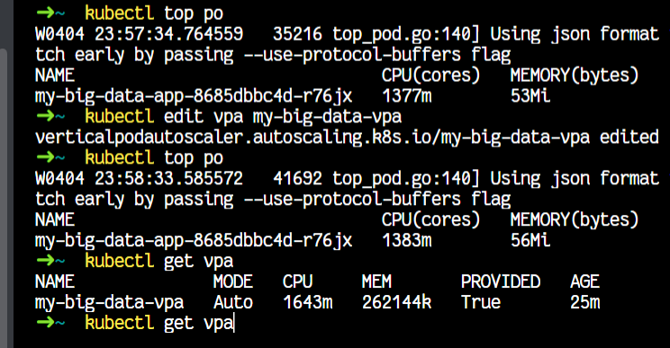
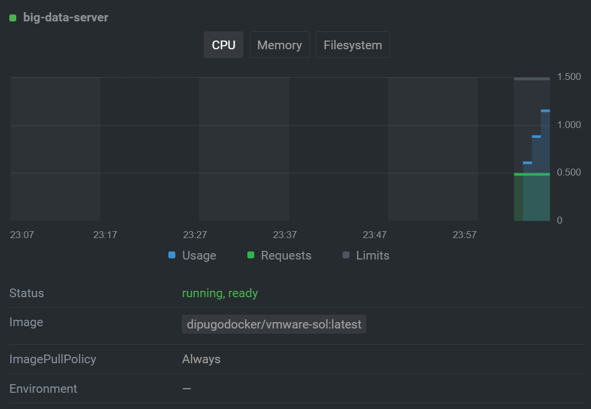
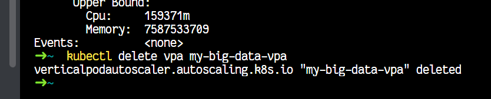

# Vertical Auto-Scaling using K8s

## Group members
1. Dipankar Das  `Kalinga Institute Industrial Technology`

## Tech Stack

1. Go
2. Simple csv file for the load
3. Azure k8s cluster
4. Docker

## How to Run

Container Image: `dipugodocker/vmware-sol:latest`

## VPA

VPA docs [here]("https://github.com/kubernetes/autoscaler/tree/master/vertical-pod-autoscaler#install-command") <br/>
Let's install the VPA from a container that can access our cluster

```shell
git clone https://github.com/kubernetes/autoscaler.git
cd autoscaler/vertical-pod-autoscaler/

./hack/vpa-up.sh

# after few seconds, we can see the VPA components in:

kubectl -n kube-system get pods

# to view the recommendations
kubectl get vpa
kubectl describe vpa <Name>
```





